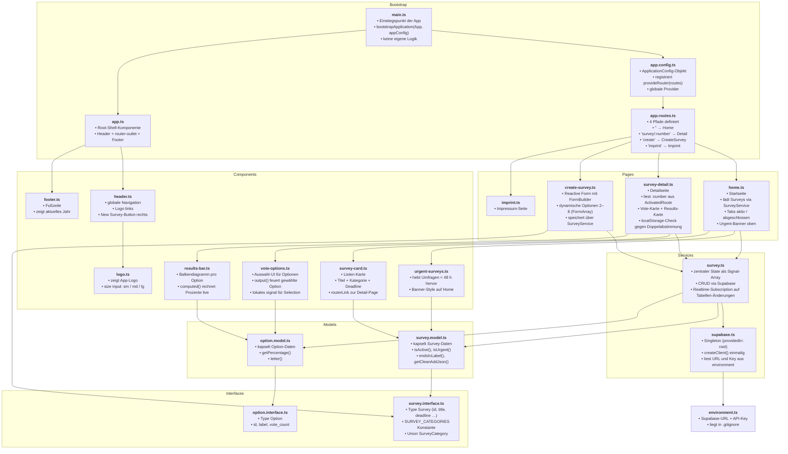

# PollApp

Echtzeit-Umfragen mit Angular und Supabase — entwickelt im Rahmen des **DA Fullstack-Kurses**.

Nutzer können Umfragen anlegen, abstimmen und Ergebnisse live verfolgen.
Supabase Realtime synchronisiert Stimmen ohne Seiten-Reload.

---

## Tech Stack

| Technologie | Version | Einsatz                                     |
| ----------- | ------- | ------------------------------------------- |
| Angular     | 21.2    | Framework, Routing, Reactive Forms, Signals |
| TypeScript  | 5.9     | Strikte Typisierung                         |
| SCSS (BEM)  | —       | Komponentenstyles, Design-Tokens            |
| Supabase    | 2.x     | PostgreSQL-Datenbank + Realtime             |
| Angular CLI | 21.2.7  | Toolchain, Build, Dev-Server                |

---

## Voraussetzungen

- **Node.js** ≥ 18
- **Angular CLI** global installiert: `npm install -g @angular/cli`
- **Supabase-Projekt** mit URL und Anon-Key (kostenlos unter [supabase.com](https://supabase.com))

---

## Setup

**1. Repository klonen**

```bash
git clone <repo-url>
cd poll-app/PollApp
```

**2. Abhängigkeiten installieren**

```bash
npm install
```

**3. Umgebungsvariablen anlegen**

Datei `src/environments/environment.ts` erstellen (liegt in `.gitignore`):

```typescript
export const environment = {
  supabaseUrl: 'https://xxxx.supabase.co',
  supabaseKey: 'your-anon-key',
};
```

**4. Entwicklungsserver starten**

```bash
npm start
```

Die App ist unter `http://localhost:4200/` erreichbar.

---

## Verfügbare Scripts

| Befehl          | Beschreibung                                    |
| --------------- | ----------------------------------------------- |
| `npm start`     | Dev-Server starten (öffnet Browser automatisch) |
| `npm run build` | Produktions-Build → `dist/`                     |
| `npm run watch` | Dev-Build mit Watch-Modus                       |
| `npm test`      | Unit-Tests ausführen                            |

---

## Routen

| Route             | Komponente     | Beschreibung                                    |
| ----------------- | -------------- | ----------------------------------------------- |
| `/`               | `Home`         | Umfragen-Liste mit Tabs (Aktiv / Abgeschlossen) |
| `/survey/:number` | `SurveyDetail` | Detailansicht, Abstimmung, Live-Ergebnis        |
| `/create`         | `CreateSurvey` | Neue Umfrage erstellen (Reactive Form)          |
| `/imprint`        | `Imprint`      | Impressum                                       |
| `/**`             | —              | Redirect → `/`                                  |

---

## Datenbankschema (Supabase)

### Tabelle `surveys`

| Spalte        | Typ       | Constraint           |
| ------------- | --------- | -------------------- |
| `id`          | uuid      | PK, default `uuid()` |
| `title`       | text      | NOT NULL             |
| `description` | text      | nullable             |
| `deadline`    | timestamp | nullable             |
| `created_at`  | timestamp | default `now()`      |

### Tabelle `options`

| Spalte       | Typ       | Constraint           |
| ------------ | --------- | -------------------- |
| `id`         | uuid      | PK, default `uuid()` |
| `survey_id`  | uuid      | FK → `surveys.id`    |
| `label`      | text      | NOT NULL             |
| `vote_count` | int       | default `0`          |
| `created_at` | timestamp | default `now()`      |

Abstimmungslogik: `vote_count` wird per Supabase-Update inkrementiert.
Keine Authentifizierung — mehrfaches Abstimmen ist by design erlaubt.

---

## Projektstruktur

```
poll-app/PollApp/
  src/
    app/
      layout/
        header/               → Header (Logo, Navigation, "New Survey"-Button)
        footer/               → Footer
      pages/
        home/                 → Home (Liste + Tabs Aktiv/Abgeschlossen)
        survey-detail/        → SurveyDetail (Vote + Live-Ergebnis)
        create-survey/        → CreateSurvey (Reactive Form)
        imprint/              → Imprint (Impressum)
      shared/
        components/
          logo/               → Logo (Größe per Input konfigurierbar)
          survey-card/        → SurveyCard (Karte in der Umfragen-Liste)
          urgent-surveys/     → UrgentSurveys (bald endende Umfragen)
          vote-options/       → VoteOptions (Abstimmungs-Buttons)
          results-bar/        → ResultsBar (Balkenanzeige Auswertung)
        interfaces/
          survey.interface.ts
          option.interface.ts
        models/
          survey.model.ts
          option.model.ts
        services/
          supabase.ts         → Supabase-Client (Singleton)
          survey.ts           → Zentraler State, CRUD, Realtime
      app.ts
      app.html
      app.scss
      app.config.ts
      app.routes.ts
    main.ts
    index.html
    environments/
      environment.ts          → Supabase URL + Key (in .gitignore)
    styles/
      styles.scss
      abstracts/
        _variables.scss       → Design-Tokens (Farben, Abstände, Breakpoints)
        _mixins.scss          → respond(), flex-center(), px-to-rem()
        _index.scss
```

---

## Architektur & Abhängigkeiten



---

## Alle Dateien im Detail

### Bootstrap & Konfiguration

| Datei           | Exportiert  | Importiert                                        | Funktion                                               |
| --------------- | ----------- | ------------------------------------------------- | ------------------------------------------------------ |
| `main.ts`       | —           | bootstrapApplication, appConfig, App              | Startet die Angular-App mit Root-Komponente und Config |
| `app.config.ts` | `appConfig` | ApplicationConfig, provideRouter, routes          | Registriert globale Provider: Router, Error-Handler    |
| `app.routes.ts` | `routes`    | Routes, Home, SurveyDetail, CreateSurvey, Imprint | Ordnet URL-Pfade den vier Page-Komponenten zu          |
| `app.ts`        | `App`       | RouterOutlet, Header, Footer                      | Shell: Header + aktuell geroutete Seite + Footer       |

---

### Shared / Interfaces

| Datei                 | Exportiert                                      | Importiert | Funktion                                                                |
| --------------------- | ----------------------------------------------- | ---------- | ----------------------------------------------------------------------- |
| `survey.interface.ts` | `Survey`, `SURVEY_CATEGORIES`, `SurveyCategory` | —          | Legt die Datenstruktur einer Umfrage fest (id, title, deadline …)       |
| `option.interface.ts` | `Option`                                        | —          | Legt die Datenstruktur einer Antwortoption fest (id, label, vote_count) |

---

### Shared / Models

| Datei             | Exportiert    | Importiert         | Funktion                                                                                         |
| ----------------- | ------------- | ------------------ | ------------------------------------------------------------------------------------------------ |
| `survey.model.ts` | `SurveyModel` | Survey (Interface) | Kapselt Survey-Daten mit Hilfsmethoden: isActive(), isUrgent(), endsInLabel(), getCleanAddJson() |
| `option.model.ts` | `OptionModel` | Option (Interface) | Kapselt Option-Daten mit Hilfsmethoden: getPercentage(), letter()                                |

---

### Shared / Services

| Datei         | Exportiert        | Importiert                                            | Funktion                                                                    |
| ------------- | ----------------- | ----------------------------------------------------- | --------------------------------------------------------------------------- |
| `supabase.ts` | `SupabaseService` | createClient, SupabaseClient, environment             | Erstellt einmalig den Supabase-Client — alle anderen Services nutzen diesen |
| `survey.ts`   | `SurveyService`   | SupabaseService, SurveyModel, OptionModel, Interfaces | Zentraler State: Signal-Array aller Umfragen + CRUD + Realtime-Subscription |

---

### Shared / Components

| Datei               | Exportiert      | Importiert                         | Funktion                                                              |
| ------------------- | --------------- | ---------------------------------- | --------------------------------------------------------------------- |
| `logo.ts`           | `Logo`          | input                              | Zeigt das App-Logo, Größe per Input (sm/md/lg) konfigurierbar         |
| `survey-card.ts`    | `SurveyCard`    | RouterLink, SurveyModel            | Karte in der Umfragen-Liste: Titel, Kategorie, Deadline-Anzeige       |
| `urgent-surveys.ts` | `UrgentSurveys` | RouterLink, SurveyModel            | Hebt Umfragen hervor, die in weniger als 48 Stunden enden             |
| `vote-options.ts`   | `VoteOptions`   | input, output, signal, OptionModel | Zeigt Abstimmungs-Optionen, gibt gewählte Option per EventEmitter aus |
| `results-bar.ts`    | `ResultsBar`    | input, computed, OptionModel       | Zeigt Balkendiagramm mit Prozentwerten pro Option                     |

---

### Layout

| Datei       | Exportiert | Importiert       | Funktion                                                   |
| ----------- | ---------- | ---------------- | ---------------------------------------------------------- |
| `header.ts` | `Header`   | RouterLink, Logo | Globale Navigation: Logo links, "New Survey"-Button rechts |
| `footer.ts` | `Footer`   | —                | Fußzeile mit aktuellem Jahr                                |

---

### Pages

| Datei              | Exportiert     | Importiert                                                | Funktion                                                                    |
| ------------------ | -------------- | --------------------------------------------------------- | --------------------------------------------------------------------------- |
| `home.ts`          | `Home`         | SurveyService, UrgentSurveys, SurveyCard                  | Startseite: Urgent-Banner + Tabs (Aktiv / Abgeschlossen) mit Umfragen-Liste |
| `survey-detail.ts` | `SurveyDetail` | SurveyService, VoteOptions, ResultsBar, ActivatedRoute    | Detailseite: Vote-Karte links + Ergebnis-Karte rechts, localStorage-Check   |
| `create-survey.ts` | `CreateSurvey` | SurveyService, FormBuilder, Validators, SURVEY_CATEGORIES | Formularseite: Reactive Form mit dynamischen Optionen (2–8 Stück)           |
| `imprint.ts`       | `Imprint`      | —                                                         | Impressum-Seite                                                             |

---

### Environments

| Datei            | Exportiert    | Importiert | Funktion                                                           |
| ---------------- | ------------- | ---------- | ------------------------------------------------------------------ |
| `environment.ts` | `environment` | —          | Enthält Supabase-URL und API-Key (nicht committen — in .gitignore) |
