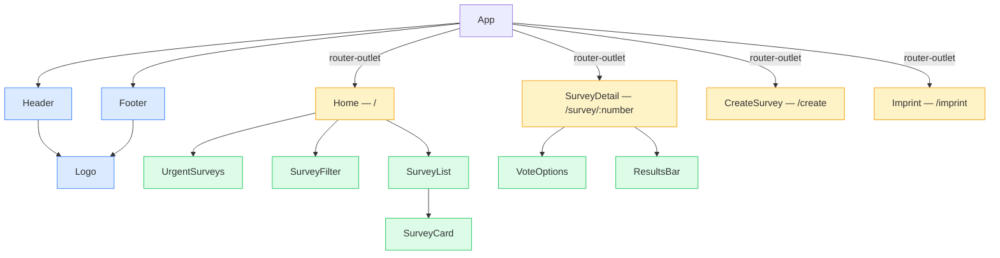
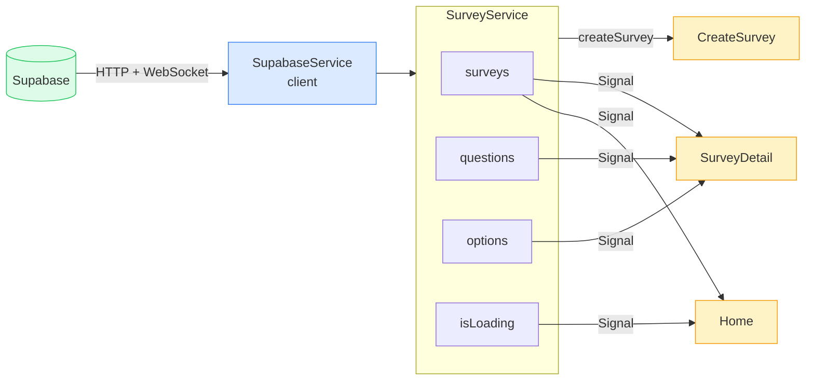

# Poll App

A real-time survey application — create polls with multiple questions, vote, and watch results update live.


---

## About

Poll App lets users create surveys with multiple questions per poll, cast votes on active polls, and see live results — powered by Supabase Realtime. No authentication required; voting is open by design.

Built as part of the **DeveloperAkademie Fullstack Course**.

---

## Tech Stack

| Layer     | Technology                                               |
| --------- | -------------------------------------------------------- |
| Framework | Angular 21 (Standalone Components, Signals, OnPush)      |
| Language  | TypeScript 5.9 (strict mode)                             |
| Styling   | SCSS with abstracts pattern (mixins, variables)          |
| Backend   | Supabase (PostgreSQL + Realtime WebSocket)               |
| Tooling   | ESLint · Prettier · Husky pre-commit hooks · lint-staged |

---

## Getting Started

**Prerequisites:** Node >= 20, npm >= 11

```bash
# 1. Install dependencies
npm install

# 2. Create the environment file (see Environment Setup below)

# 3. Start the dev server
npm start
```

The app is available at `http://localhost:4200/`.

### Environment Setup

Create `src/environments/environment.ts` — this file is in `.gitignore` and must not be committed:

```ts
export const environment = {
  supabaseUrl: 'YOUR_SUPABASE_PROJECT_URL',
  supabaseKey: 'YOUR_SUPABASE_ANON_KEY',
};
```

---

## Available Scripts

| Command         | Description                               |
| --------------- | ----------------------------------------- |
| `npm start`     | Dev server with auto-open (`ng serve -o`) |
| `npm run build` | Production build → `dist/`                |
| `npm run watch` | Dev build with watch mode                 |
| `npm run lint`  | ESLint — 0 warnings allowed               |

---

## Routing

| Route             | Component      | Description                                             |
| ----------------- | -------------- | ------------------------------------------------------- |
| `/`               | `Home`         | Survey list with Active / Past tabs and category filter |
| `/survey/:number` | `SurveyDetail` | Detail view, multi-question voting, live results        |
| `/create`         | `CreateSurvey` | Create a new survey with dynamic multi-question form    |
| `/imprint`        | `Imprint`      | Legal imprint page                                      |
| `/**`             | —              | Redirect → `/`                                          |

---

## Project Structure

```
PollApp/
  src/
    app/
      layout/
        header/               → Header (logo, nav, "New Survey" button)
        footer/               → Footer
      pages/
        home/                 → Home (list + Active/Past tabs + category filter)
          survey-filter/      → SurveyFilter (tab + category dropdown)
          survey-list/        → SurveyList (rendered list of SurveyCards)
        survey-detail/        → SurveyDetail (vote + live results per question)
        create-survey/        → CreateSurvey (multi-question reactive form)
        imprint/              → Imprint (legal page)
      shared/
        components/
          logo/               → Logo (size configurable via input)
          survey-card/        → SurveyCard (card in survey list)
          urgent-surveys/     → UrgentSurveys (expiring soon, top 3)
          vote-options/       → VoteOptions (voting buttons per question)
          results-bar/        → ResultsBar (bar chart for results)
        interfaces/
          survey.interface.ts   Survey, SURVEY_CATEGORIES, SurveyCategory
          option.interface.ts   Option
          question.interface.ts Question
        services/
          supabase.ts           SupabaseService — singleton createClient wrapper
          survey.ts             SurveyService — signals + CRUD + helpers
        validators/
          survey.validators.ts  noWhitespaceValidator, futureDateValidator
      app.ts / app.html / app.scss / app.config.ts / app.routes.ts
    main.ts
    index.html
    environments/
      environment.ts          (not committed — listed in .gitignore)
    styles/
      styles.scss
      _tokens.scss            raw design tokens (colors, spacing, breakpoints, shadows)
      _abstracts.scss         @forward entry point for tokens
      abstracts/
        _variables.scss       SCSS variables
        _mixins.scss          respond(), flex-center(), px-to-rem()
        _index.scss           @forward for all abstracts
```

---

## Database Schema

Three tables in Supabase (PostgreSQL):

### `surveys`

| Column          | Type      | Constraint                 |
| --------------- | --------- | -------------------------- |
| `id`            | uuid      | PK, default `uuid()`       |
| `survey_number` | int       | auto-increment             |
| `title`         | text      | NOT NULL                   |
| `description`   | text      | nullable                   |
| `category`      | text      | nullable                   |
| `deadline`      | timestamp | nullable                   |
| `status`        | text      | `'draft'` \| `'published'` |
| `created_at`    | timestamp | default `now()`            |

### `questions`

| Column           | Type      | Constraint           |
| ---------------- | --------- | -------------------- |
| `id`             | uuid      | PK, default `uuid()` |
| `survey_id`      | uuid      | FK → `surveys.id`    |
| `label`          | text      | NOT NULL             |
| `allow_multiple` | boolean   | default `false`      |
| `order_index`    | int       | NOT NULL             |
| `created_at`     | timestamp | default `now()`      |

### `options`

| Column        | Type      | Constraint           |
| ------------- | --------- | -------------------- |
| `id`          | uuid      | PK, default `uuid()` |
| `survey_id`   | uuid      | FK → `surveys.id`    |
| `question_id` | uuid      | FK → `questions.id`  |
| `label`       | text      | NOT NULL             |
| `vote_count`  | int       | default `0`          |
| `created_at`  | timestamp | default `now()`      |

Voting increments `vote_count` via Supabase update. No auth — multiple votes are allowed by design. Completed surveys are tracked in `localStorage`.

---

## Architecture

### Diagram 1: Component Hierarchy

> Blue = Layout · Yellow = Pages (routed) · Green = Shared Components



### Diagram 2: Data Flow — Services & Signals



---

## Key Files

### Bootstrap & Config

| File            | Description                                              |
| --------------- | -------------------------------------------------------- |
| `main.ts`       | App entry point — `bootstrapApplication(App, appConfig)` |
| `app.config.ts` | Global providers: `provideRouter`, error handlers        |
| `app.routes.ts` | Maps URL paths to page components                        |
| `app.ts`        | Root shell: `Header` + `<router-outlet>` + `Footer`      |

### Services

| File          | Description                                                          |
| ------------- | -------------------------------------------------------------------- |
| `supabase.ts` | Singleton `createClient` wrapper — all other services use this       |
| `survey.ts`   | Central state as signals + CRUD + Realtime subscription + helper fns |

### Interfaces

| File                    | Exports                                         |
| ----------------------- | ----------------------------------------------- |
| `survey.interface.ts`   | `Survey`, `SURVEY_CATEGORIES`, `SurveyCategory` |
| `option.interface.ts`   | `Option`                                        |
| `question.interface.ts` | `Question`                                      |

### Validators

| File                   | Exports                                        |
| ---------------------- | ---------------------------------------------- |
| `survey.validators.ts` | `noWhitespaceValidator`, `futureDateValidator` |

### Shared Components

| File                | Description                                                |
| ------------------- | ---------------------------------------------------------- |
| `logo.ts`           | App logo, size configurable via input (`sm` / `md` / `lg`) |
| `survey-card.ts`    | Survey list card — title, category, deadline               |
| `urgent-surveys.ts` | Highlights surveys expiring within 48 hours                |
| `vote-options.ts`   | Voting UI per question, emits selection via `output()`     |
| `results-bar.ts`    | Bar chart with live percentages per option                 |

### Pages

| File               | Description                                                          |
| ------------------ | -------------------------------------------------------------------- |
| `home.ts`          | Urgent banner + Active / Past tabs + category filter                 |
| `survey-detail.ts` | Vote card + results card, `localStorage` check for completed surveys |
| `create-survey.ts` | Reactive Form with `FormArray` for dynamic questions (2–8 options)   |
| `imprint.ts`       | Legal imprint page                                                   |

---

## Reference: Imports & Exports

---

### Interfaces & Types

**File:** `src/app/shared/interfaces/survey.interface.ts`

```ts
export interface Survey {
  id: string;                     // unique UUID of the survey
  survey_number: number;          // sequential number for readable URLs (/survey/42)
  title: string;                  // survey title (required)
  description: string | null;     // optional description
  category: string | null;        // category (e.g. "Feedback") or null
  deadline: string | null;        // ISO date string or null (no deadline)
  status: 'draft' | 'published';  // only 'published' surveys are shown in the app
  created_at: string;             // creation date as ISO string
}

export const SURVEY_CATEGORIES: readonly string[]
// Fixed list of all possible categories:
// 'Team activities' | 'Workplace culture' | 'Feedback' | 'Events' | 'Product' | 'Other'

export type SurveyCategory
// Union type derived from SURVEY_CATEGORIES values
```

**File:** `src/app/shared/interfaces/question.interface.ts`

```ts
export interface Question {
  id: string; // unique UUID of the question
  survey_id: string; // foreign key → surveys.id
  label: string; // question text (required)
  allow_multiple: boolean; // true = multiple selection allowed
  order_index: number; // order of the question within the survey
  created_at: string; // creation date as ISO string
}
```

**File:** `src/app/shared/interfaces/option.interface.ts`

```ts
export interface Option {
  id: string; // unique UUID of the answer option
  survey_id: string; // foreign key → surveys.id
  question_id: string; // foreign key → questions.id
  label: string; // display text of the option (required)
  vote_count: number; // current vote count (default 0)
  created_at: string; // creation date as ISO string
}
```

---

### Validators

**File:** `src/app/shared/validators/survey.validators.ts`

| Export                  | Signature                                                | Description                                                                                                   |
| ----------------------- | -------------------------------------------------------- | ------------------------------------------------------------------------------------------------------------- |
| `noWhitespaceValidator` | `(control: AbstractControl) => ValidationErrors \| null` | Returns `{ whitespace: true }` when the field value is empty after `trim()` — prevents whitespace-only inputs |
| `futureDateValidator`   | `(control: AbstractControl) => ValidationErrors \| null` | Returns `{ pastDate: true }` when the entered date is in the past — ensures deadlines are set in the future   |

---

### Services

#### SupabaseService

**File:** `src/app/shared/services/supabase.ts`  
**Provided:** `@Injectable({ providedIn: 'root' })` — app-wide singleton

| Export   | Type             | Description                                                                                                        |
| -------- | ---------------- | ------------------------------------------------------------------------------------------------------------------ |
| `client` | `SupabaseClient` | Single Supabase client instance created from `environment.ts` — all other services use this to access the database |

---

#### SurveyService

**File:** `src/app/shared/services/survey.ts`  
**Provided:** `@Injectable({ providedIn: 'root' })` — app-wide singleton

##### Readonly Signals (State)

| Signal      | Type                 | Description                                                                       |
| ----------- | -------------------- | --------------------------------------------------------------------------------- |
| `surveys`   | `Signal<Survey[]>`   | All loaded published surveys — populated by `loadSurveys()`                       |
| `questions` | `Signal<Question[]>` | All questions of the most recently loaded survey(s)                               |
| `options`   | `Signal<Option[]>`   | All answer options of the most recently loaded survey(s)                          |
| `isLoading` | `Signal<boolean>`    | `true` while a database request is running — used for loading states in templates |

##### Computed Getters (Derived Signals)

| Method                           | Returns              | Description                                                                                              |
| -------------------------------- | -------------------- | -------------------------------------------------------------------------------------------------------- |
| `questionsFor(surveyId: string)` | `Signal<Question[]>` | Returns a `computed()` signal with questions for a specific survey, filtered and sorted by `order_index` |
| `optionsFor(questionId: string)` | `Signal<Option[]>`   | Returns a `computed()` signal with all answer options for a specific question                            |

##### Public Methods (CRUD)

| Method                     | Signature                                                          | Description                                                                                                              |
| -------------------------- | ------------------------------------------------------------------ | ------------------------------------------------------------------------------------------------------------------------ |
| `loadSurveys`              | `() => Promise<void>`                                              | Loads all published surveys from Supabase (descending by `created_at`) and sets the `surveys` signal                     |
| `loadSurveyWithOptions`    | `(surveyNumber: number) => Promise<Survey \| null>`                | Loads a single survey by its sequential number including all questions and options; adds it to the local cache           |
| `createSurvey`             | `(surveyData, questionInputs: QuestionInput[]) => Promise<Survey>` | Creates a new survey in Supabase, inserts questions and options, updates the `surveys` signal                            |
| `vote`                     | `(optionId: string) => Promise<void>`                              | Calls the Supabase RPC function `increment_vote` and updates the option's `vote_count` directly in the local signal      |
| `subscribeToOptionUpdates` | `(surveyId: string) => RealtimeChannel`                            | Registers a Realtime subscription for vote updates on a survey; returns the channel for cleanup via `unsubscribeChannel` |
| `subscribeToSurveyInserts` | `() => RealtimeChannel`                                            | Registers a Realtime subscription for newly created surveys; returns the channel for cleanup via `unsubscribeChannel`    |
| `unsubscribeChannel`       | `(channel: RealtimeChannel) => void`                               | Disconnects a Realtime channel — called in `DestroyRef.onDestroy`                                                        |

##### Helper Functions (standalone exports from `survey.ts`)

These functions are exported directly from the file — no class member, no `inject()` needed.

| Function               | Signature                     | Description                                                                                                   |
| ---------------------- | ----------------------------- | ------------------------------------------------------------------------------------------------------------- |
| `isSurveyActive`       | `(survey: Survey) => boolean` | Returns `true` if the survey has no deadline or the deadline is in the future                                 |
| `isSurveyUrgent`       | `(survey: Survey) => boolean` | Returns `true` if the deadline falls between now and the next 48 hours                                        |
| `getSurveyEndsInLabel` | `(survey: Survey) => string`  | Returns a human-readable expiry label, e.g. `"Ends in 3h"`, `"Ends in 2 Days"`, `"Ended"`, or `"No deadline"` |
| `getSurveyEndsOnLabel` | `(survey: Survey) => string`  | Returns the deadline formatted as `"DD.MM.YYYY"` — empty string if no deadline                                |
| `getOptionLetter`      | `(index: number) => string`   | Converts an index to a letter label: `0 → "A."`, `1 → "B."`, etc.                                             |

##### Interface (exported from `survey.ts`)

```ts
export interface QuestionInput {
  label: string; // question text
  allow_multiple: boolean; // multiple selection allowed?
  answers: string[]; // array of answer texts
}
```

---

### Shared Components

#### Logo

**File:** `src/app/shared/components/logo/logo.ts`  
**Selector:** `<app-logo>`

| Kind      | Name   | Type                   | Default | Description                           |
| --------- | ------ | ---------------------- | ------- | ------------------------------------- |
| `input()` | `size` | `'sm' \| 'md' \| 'lg'` | `'md'`  | Controls the display size of the logo |

---

#### SurveyCard

**File:** `src/app/shared/components/survey-card/survey-card.ts`  
**Selector:** `<app-survey-card>`

| Kind               | Name        | Type      | Default | Description                                                    |
| ------------------ | ----------- | --------- | ------- | -------------------------------------------------------------- |
| `input.required()` | `survey`    | `Survey`  | —       | The survey to display                                          |
| `input()`          | `isPast`    | `boolean` | `false` | Controls whether the card is rendered in the "expired" style   |
| `computed`         | `endsLabel` | `string`  | —       | Derived text for remaining time, e.g. `"Ends in 5h"`           |
| `computed`         | `category`  | `string`  | —       | Category of the survey — falls back to `"General"` when `null` |

---

#### UrgentSurveys

**File:** `src/app/shared/components/urgent-surveys/urgent-surveys.ts`  
**Selector:** `<app-urgent-surveys>`

| Kind               | Name      | Type       | Default | Description                                            |
| ------------------ | --------- | ---------- | ------- | ------------------------------------------------------ |
| `input.required()` | `surveys` | `Survey[]` | —       | List of urgent surveys (already capped at 3 by `Home`) |

| Method        | Signature                    | Description                                                                              |
| ------------- | ---------------------------- | ---------------------------------------------------------------------------------------- |
| `endsInLabel` | `(survey: Survey) => string` | Delegates to `getSurveyEndsInLabel()` — makes the helper function available in templates |

---

#### VoteOptions

**File:** `src/app/shared/components/vote-options/vote-options.ts`  
**Selector:** `<app-vote-options>`

| Kind               | Name              | Type                  | Default     | Description                                                                        |
| ------------------ | ----------------- | --------------------- | ----------- | ---------------------------------------------------------------------------------- |
| `input.required()` | `options`         | `Option[]`            | —           | The answer options of the current question                                         |
| `input()`          | `disabled`        | `boolean`             | `false`     | Disables all voting buttons (e.g. after a vote has been cast)                      |
| `input()`          | `allowMultiple`   | `boolean`             | `false`     | Allows multiple selection — when `false`, each selection replaces the previous one |
| `output()`         | `selectionChange` | `string[]`            | —           | Emitted when the selection changes — provides an array of selected option IDs      |
| `signal`           | `selectedIds`     | `Signal<Set<string>>` | `new Set()` | Internal state of the current selection                                            |

| Method       | Signature                   | Description                                                                                   |
| ------------ | --------------------------- | --------------------------------------------------------------------------------------------- |
| `letter`     | `(index: number) => string` | Returns the letter label for an index (`"A."`, `"B."`, …)                                     |
| `isSelected` | `(id: string) => boolean`   | Returns `true` if the option with the given ID is currently selected                          |
| `select`     | `(id: string) => void`      | Selects an option — toggles when `allowMultiple`, replaces otherwise; emits `selectionChange` |

---

#### ResultsBar

**File:** `src/app/shared/components/results-bar/results-bar.ts`  
**Selector:** `<app-results-bar>`

| Kind               | Name               | Type       | Default | Description                                                                |
| ------------------ | ------------------ | ---------- | ------- | -------------------------------------------------------------------------- |
| `input.required()` | `options`          | `Option[]` | —       | All answer options of the question with their `vote_count` values          |
| `input()`          | `previewOptionIds` | `string[]` | `[]`    | IDs of currently selected options — shows a vote preview before submitting |
| `computed`         | `totalVotes`       | `number`   | —       | Sum of all cast votes plus preview votes                                   |
| `computed`         | `votesLabel`       | `string`   | —       | `"vote"` (singular) or `"votes"` (plural) depending on `totalVotes`        |

| Method       | Signature                     | Description                                                               |
| ------------ | ----------------------------- | ------------------------------------------------------------------------- |
| `letter`     | `(index: number) => string`   | Letter label for an index                                                 |
| `percentage` | `(option: Option) => number`  | Calculates the rounded percentage of an option including the preview vote |
| `isPreview`  | `(option: Option) => boolean` | Returns `true` if the option is included in the preview selection         |

---

#### SurveyFilter _(Sub-component of Home)_

**File:** `src/app/pages/home/survey-filter/survey-filter.ts`  
**Selector:** `<app-survey-filter>`

| Kind               | Name               | Type                 | Default | Description                                        |
| ------------------ | ------------------ | -------------------- | ------- | -------------------------------------------------- |
| `input.required()` | `activeTab`        | `'active' \| 'past'` | —       | Currently active tab                               |
| `input()`          | `selectedCategory` | `string \| null`     | `null`  | Currently selected category — `null` means "all"   |
| `input.required()` | `categories`       | `readonly string[]`  | —       | List of all available categories                   |
| `output()`         | `tabChange`        | `'active' \| 'past'` | —       | Emitted when the user selects a different tab      |
| `output()`         | `categoryChange`   | `string \| null`     | —       | Emitted when the user selects a different category |
| `signal`           | `isDropdownOpen`   | `Signal<boolean>`    | `false` | Controls whether the category dropdown is open     |

| Method           | Signature                                 | Description                                                         |
| ---------------- | ----------------------------------------- | ------------------------------------------------------------------- |
| `setTab`         | `(tab: 'active' \| 'past') => void`       | Closes the dropdown and emits the tab change event                  |
| `onTabKeydown`   | `(event: KeyboardEvent, current) => void` | Enables keyboard navigation between tabs with arrow left/right keys |
| `setCategory`    | `(category: string \| null) => void`      | Closes the dropdown and emits the category change event             |
| `toggleDropdown` | `() => void`                              | Opens or closes the dropdown                                        |

---

#### SurveyList _(Sub-component of Home)_

**File:** `src/app/pages/home/survey-list/survey-list.ts`  
**Selector:** `<app-survey-list>`

| Kind               | Name        | Type                 | Default | Description                                      |
| ------------------ | ----------- | -------------------- | ------- | ------------------------------------------------ |
| `input.required()` | `surveys`   | `Survey[]`           | —       | Surveys to display (already filtered and sorted) |
| `input.required()` | `isLoading` | `boolean`            | —       | Shows a loading state when `true`                |
| `input()`          | `loadError` | `string \| null`     | `null`  | Error message displayed instead of the list      |
| `input.required()` | `isPast`    | `boolean`            | —       | Passed to `SurveyCard` for the expired style     |
| `input.required()` | `activeTab` | `'active' \| 'past'` | —       | Controls empty-state texts per tab               |

---

### Layout Components

#### Header

**File:** `src/app/layout/header/header.ts`  
**Selector:** `<app-header>`

Pure presentation component — no state, no methods.  
Imports: `RouterLink`, `Logo`

---

#### Footer

**File:** `src/app/layout/footer/footer.ts`  
**Selector:** `<app-footer>`

| Kind         | Name   | Type     | Description                                                           |
| ------------ | ------ | -------- | --------------------------------------------------------------------- |
| Class member | `year` | `number` | Current year from `new Date().getFullYear()` — for the copyright line |

Imports: `RouterLink`, `Logo`

---

### Page Components

#### Home

**File:** `src/app/pages/home/home.ts`  
**Route:** `/`

##### Signals & Readonly

| Name               | Type                         | Description                                         |
| ------------------ | ---------------------------- | --------------------------------------------------- |
| `surveys`          | `Signal<Survey[]>`           | All surveys — bound directly from `SurveyService`   |
| `isLoading`        | `Signal<boolean>`            | Loading state — bound directly from `SurveyService` |
| `activeTab`        | `Signal<'active' \| 'past'>` | Currently selected tab, starts with `'active'`      |
| `selectedCategory` | `Signal<string \| null>`     | Selected category — `null` shows all categories     |
| `loadError`        | `Signal<string \| null>`     | Error message when loading surveys fails            |
| `categories`       | `readonly string[]`          | List of all categories (from `SURVEY_CATEGORIES`)   |

##### Computed

| Name               | Type               | Description                                                              |
| ------------------ | ------------------ | ------------------------------------------------------------------------ |
| `activeSurveys`    | `Signal<Survey[]>` | Active surveys for the selected category, sorted ascending by deadline   |
| `pastSurveys`      | `Signal<Survey[]>` | Expired surveys for the selected category, sorted descending by deadline |
| `urgentSurveys`    | `Signal<Survey[]>` | The first three active surveys expiring within 48 hours                  |
| `displayedSurveys` | `Signal<Survey[]>` | Returns `activeSurveys` or `pastSurveys` depending on the active tab     |
| `isPastTab`        | `Signal<boolean>`  | `true` when the `'past'` tab is active                                   |

##### Methods

| Method        | Signature                            | Description                                                      |
| ------------- | ------------------------------------ | ---------------------------------------------------------------- |
| `ngOnInit`    | `() => Promise<void>`                | Calls `surveyService.loadSurveys()`; sets `loadError` on failure |
| `setTab`      | `(tab: 'active' \| 'past') => void`  | Updates the `activeTab` signal                                   |
| `setCategory` | `(category: string \| null) => void` | Updates the `selectedCategory` signal                            |

---

#### SurveyDetail

**File:** `src/app/pages/survey-detail/survey-detail.ts`  
**Route:** `/survey/:number`

##### Signals

| Name           | Type                            | Description                                                               |
| -------------- | ------------------------------- | ------------------------------------------------------------------------- |
| `survey`       | `Signal<Survey \| null>`        | The loaded survey — `null` while not yet loaded                           |
| `questions`    | `Signal<Question[]>`            | Questions of the loaded survey                                            |
| `hasCompleted` | `Signal<boolean>`               | `true` if the user has already voted on this survey (from `localStorage`) |
| `isSubmitting` | `Signal<boolean>`               | `true` while votes are being sent to Supabase                             |
| `errorMessage` | `Signal<string \| null>`        | Error message when loading or voting fails                                |
| `selections`   | `Signal<Map<string, string[]>>` | Current user selection: `QuestionID → OptionIDs`                          |

##### Computed

| Name           | Type                    | Description                                                       |
| -------------- | ----------------------- | ----------------------------------------------------------------- |
| `endsOnLabel`  | `Signal<string>`        | Formatted deadline date (e.g. `"31.12.2025"`) or empty string     |
| `questionRows` | `Signal<QuestionRow[]>` | Combines questions and options into renderable rows with headings |
| `allAnswered`  | `Signal<boolean>`       | `true` when all questions have at least one selection             |

##### Methods

| Method              | Signature                                     | Description                                                                                 |
| ------------------- | --------------------------------------------- | ------------------------------------------------------------------------------------------- |
| `ngOnInit`          | `() => Promise<void>`                         | Reads the `:number` param from the URL, validates it, and calls `loadSurvey()`              |
| `onSelectionChange` | `(questionId: string, ids: string[]) => void` | Updates the `selections` map when the user makes a selection                                |
| `previewIds`        | `(questionId: string) => string[]`            | Returns the current selection for a question — used for the preview in `ResultsBar`         |
| `completeSurvey`    | `() => Promise<void>`                         | Validates, sends all votes in parallel, and marks the survey in `localStorage` as completed |

---

#### CreateSurvey

**File:** `src/app/pages/create-survey/create-survey.ts`  
**Route:** `/create`

##### Signals & Class Members

| Name              | Type                        | Description                                                       |
| ----------------- | --------------------------- | ----------------------------------------------------------------- |
| `isSubmitting`    | `Signal<boolean>`           | `true` while the form submit is running                           |
| `errorMessage`    | `Signal<string \| null>`    | Error message when saving fails                                   |
| `getOptionLetter` | `(index: number) => string` | Helper function as class member — makes it available in templates |
| `categories`      | `readonly string[]`         | Category list for the dropdown                                    |

##### Form Structure

```ts
FormGroup {
  title:       FormControl<string>  // required · minLength(3) · maxLength(100) · noWhitespaceValidator
  description: FormControl<string>  // optional · noWhitespaceValidator
  category:    FormControl<string>  // required · default 'Team activities'
  deadline:    FormControl<string>  // optional · futureDateValidator
  questions:   FormArray<FormGroup> {
    label:          FormControl<string>   // required · noWhitespaceValidator · maxLength(200)
    allow_multiple: FormControl<boolean>  // default false
    answers:        FormArray<FormControl<string>> {
      // min. 2, max. 8 entries
      // each entry: required · noWhitespaceValidator · maxLength(60)
    }
  }
}
```

##### Methods

| Method                 | Signature                                              | Description                                                                          |
| ---------------------- | ------------------------------------------------------ | ------------------------------------------------------------------------------------ |
| `questions` _(Getter)_ | `FormArray`                                            | Returns the questions `FormArray` from the form                                      |
| `getAnswers`           | `(questionIndex: number) => FormArray`                 | Returns the answers `FormArray` for a specific question                              |
| `addQuestion`          | `() => void`                                           | Appends a new question with two empty answer fields                                  |
| `removeQuestion`       | `(index: number) => void`                              | Removes a question — at least one question always remains                            |
| `addAnswer`            | `(questionIndex: number) => void`                      | Adds an answer field — maximum 8 answers per question                                |
| `removeAnswer`         | `(questionIndex: number, answerIndex: number) => void` | Removes an answer field — minimum 2 answers always remain                            |
| `submit`               | `() => Promise<void>`                                  | Marks all fields as touched, checks validity, saves, and navigates to the new survey |

---

#### Imprint

**File:** `src/app/pages/imprint/imprint.ts`  
**Route:** `/imprint`

Pure presentation component — no state, no methods, no inputs.
