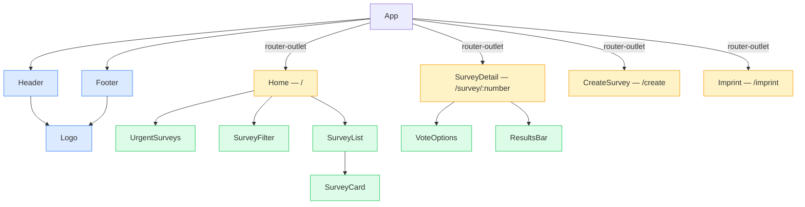
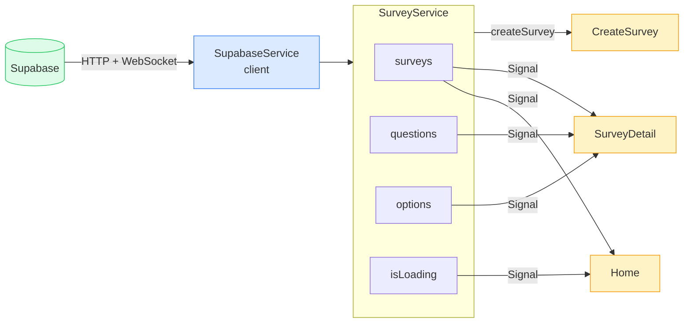

# Poll App

A real-time survey application — create polls with multiple questions, vote, and watch results update live.


---

## About

Poll App lets users create surveys with multiple questions per poll, cast votes on active polls, and see live results — powered by Supabase Realtime. No authentication required; voting is open by design.

Built as part of the **DeveloperAkademie Fullstack Course**.

---

## Tech Stack

| Layer     | Technology                                               |
| --------- | -------------------------------------------------------- |
| Framework | Angular 21 (Standalone Components, Signals, OnPush)      |
| Language  | TypeScript 5.9 (strict mode)                             |
| Styling   | SCSS with abstracts pattern (mixins, variables)          |
| Backend   | Supabase (PostgreSQL + Realtime WebSocket)               |
| Tooling   | ESLint · Prettier · Husky pre-commit hooks · lint-staged |

---

## Getting Started

**Prerequisites:** Node >= 20, npm >= 11

```bash
# 1. Install dependencies
npm install

# 2. Create the environment file (see Environment Setup below)

# 3. Start the dev server
npm start
```

The app is available at `http://localhost:4200/`.

### Environment Setup

Create `src/environments/environment.ts` — this file is in `.gitignore` and must not be committed:

```ts
export const environment = {
  supabaseUrl: 'YOUR_SUPABASE_PROJECT_URL',
  supabaseKey: 'YOUR_SUPABASE_ANON_KEY',
};
```

---

## Available Scripts

| Command         | Description                               |
| --------------- | ----------------------------------------- |
| `npm start`     | Dev server with auto-open (`ng serve -o`) |
| `npm run build` | Production build → `dist/`                |
| `npm run watch` | Dev build with watch mode                 |
| `npm run lint`  | ESLint — 0 warnings allowed               |

---

## Routing

| Route             | Component      | Description                                             |
| ----------------- | -------------- | ------------------------------------------------------- |
| `/`               | `Home`         | Survey list with Active / Past tabs and category filter |
| `/survey/:number` | `SurveyDetail` | Detail view, multi-question voting, live results        |
| `/create`         | `CreateSurvey` | Create a new survey with dynamic multi-question form    |
| `/imprint`        | `Imprint`      | Legal imprint page                                      |
| `/**`             | —              | Redirect → `/`                                          |

---

## Project Structure

```
PollApp/
  src/
    app/
      layout/
        header/               → Header (logo, nav, "New Survey" button)
        footer/               → Footer
      pages/
        home/                 → Home (list + Active/Past tabs + category filter)
          survey-filter/      → SurveyFilter (tab + category dropdown)
          survey-list/        → SurveyList (rendered list of SurveyCards)
        survey-detail/        → SurveyDetail (vote + live results per question)
        create-survey/        → CreateSurvey (multi-question reactive form)
        imprint/              → Imprint (legal page)
      shared/
        components/
          logo/               → Logo (size configurable via input)
          survey-card/        → SurveyCard (card in survey list)
          urgent-surveys/     → UrgentSurveys (expiring soon, top 3)
          vote-options/       → VoteOptions (voting buttons per question)
          results-bar/        → ResultsBar (bar chart for results)
        interfaces/
          survey.interface.ts   Survey, SURVEY_CATEGORIES, SurveyCategory
          option.interface.ts   Option
          question.interface.ts Question
        services/
          supabase.ts           SupabaseService — singleton createClient wrapper
          survey.ts             SurveyService — signals + CRUD + helpers
        validators/
          survey.validators.ts  noWhitespaceValidator, futureDateValidator
      app.ts / app.html / app.scss / app.config.ts / app.routes.ts
    main.ts
    index.html
    environments/
      environment.ts          (not committed — listed in .gitignore)
    styles/
      styles.scss
      abstracts/
        _variables.scss       design tokens (colors, spacing, breakpoints)
        _mixins.scss          respond(), flex-center(), px-to-rem()
        _index.scss           @forward for all abstracts
```

---

## Database Schema

Three tables in Supabase (PostgreSQL):

### `surveys`

| Column          | Type      | Constraint                 |
| --------------- | --------- | -------------------------- |
| `id`            | uuid      | PK, default `uuid()`       |
| `survey_number` | int       | auto-increment             |
| `title`         | text      | NOT NULL                   |
| `description`   | text      | nullable                   |
| `category`      | text      | nullable                   |
| `deadline`      | timestamp | nullable                   |
| `status`        | text      | `'draft'` \| `'published'` |
| `created_at`    | timestamp | default `now()`            |

### `questions`

| Column           | Type      | Constraint           |
| ---------------- | --------- | -------------------- |
| `id`             | uuid      | PK, default `uuid()` |
| `survey_id`      | uuid      | FK → `surveys.id`    |
| `label`          | text      | NOT NULL             |
| `allow_multiple` | boolean   | default `false`      |
| `order_index`    | int       | NOT NULL             |
| `created_at`     | timestamp | default `now()`      |

### `options`

| Column        | Type      | Constraint           |
| ------------- | --------- | -------------------- |
| `id`          | uuid      | PK, default `uuid()` |
| `survey_id`   | uuid      | FK → `surveys.id`    |
| `question_id` | uuid      | FK → `questions.id`  |
| `label`       | text      | NOT NULL             |
| `vote_count`  | int       | default `0`          |
| `created_at`  | timestamp | default `now()`      |

Voting increments `vote_count` via Supabase update. No auth — multiple votes are allowed by design. Completed surveys are tracked in `localStorage`.

---

## Architecture

### Diagramm 1: Komponenten-Hierarchie

> Blau = Layout · Gelb = Pages (geroutet) · Grün = Shared Components



### Diagramm 2: Datenfluss — Services & Signals



---

## Key Files

### Bootstrap & Config

| File            | Description                                              |
| --------------- | -------------------------------------------------------- |
| `main.ts`       | App entry point — `bootstrapApplication(App, appConfig)` |
| `app.config.ts` | Global providers: `provideRouter`, error handlers        |
| `app.routes.ts` | Maps URL paths to page components                        |
| `app.ts`        | Root shell: `Header` + `<router-outlet>` + `Footer`      |

### Services

| File          | Description                                                          |
| ------------- | -------------------------------------------------------------------- |
| `supabase.ts` | Singleton `createClient` wrapper — all other services use this       |
| `survey.ts`   | Central state as signals + CRUD + Realtime subscription + helper fns |

### Interfaces

| File                    | Exports                                         |
| ----------------------- | ----------------------------------------------- |
| `survey.interface.ts`   | `Survey`, `SURVEY_CATEGORIES`, `SurveyCategory` |
| `option.interface.ts`   | `Option`                                        |
| `question.interface.ts` | `Question`                                      |

### Validators

| File                   | Exports                                        |
| ---------------------- | ---------------------------------------------- |
| `survey.validators.ts` | `noWhitespaceValidator`, `futureDateValidator` |

### Shared Components

| File                | Description                                                |
| ------------------- | ---------------------------------------------------------- |
| `logo.ts`           | App logo, size configurable via input (`sm` / `md` / `lg`) |
| `survey-card.ts`    | Survey list card — title, category, deadline               |
| `urgent-surveys.ts` | Highlights surveys expiring within 48 hours                |
| `vote-options.ts`   | Voting UI per question, emits selection via `output()`     |
| `results-bar.ts`    | Bar chart with live percentages per option                 |

### Pages

| File               | Description                                                          |
| ------------------ | -------------------------------------------------------------------- |
| `home.ts`          | Urgent banner + Active / Past tabs + category filter                 |
| `survey-detail.ts` | Vote card + results card, `localStorage` check for completed surveys |
| `create-survey.ts` | Reactive Form with `FormArray` for dynamic questions (2–8 options)   |
| `imprint.ts`       | Legal imprint page                                                   |

---

## Referenz: Imports & Exports

> Arbeitsdokument — Beschreibungen auf Deutsch, wird später überarbeitet.

---

### Interfaces & Typen

**Datei:** `src/app/shared/interfaces/survey.interface.ts`

```ts
export interface Survey {
  id: string;            // Eindeutige UUID der Umfrage
  survey_number: number; // Fortlaufende Nummer für lesbare URLs (/survey/42)
  title: string;         // Titel der Umfrage (Pflichtfeld)
  description: string | null; // Optionale Beschreibung
  category: string | null;    // Kategorie (z. B. "Feedback") oder null
  deadline: string | null;    // ISO-Datum-String oder null (kein Ablaufdatum)
  status: 'draft' | 'published'; // Nur 'published' wird in der App angezeigt
  created_at: string;    // Erstellungsdatum als ISO-String
}

export const SURVEY_CATEGORIES: readonly string[]
// Feste Liste aller möglichen Kategorien:
// 'Team activities' | 'Workplace culture' | 'Feedback' | 'Events' | 'Product' | 'Other'

export type SurveyCategory
// Union-Typ aus den SURVEY_CATEGORIES-Werten
```

**Datei:** `src/app/shared/interfaces/question.interface.ts`

```ts
export interface Question {
  id: string; // Eindeutige UUID der Frage
  survey_id: string; // Fremdschlüssel → surveys.id
  label: string; // Fragetext (Pflichtfeld)
  allow_multiple: boolean; // true = Mehrfachauswahl erlaubt
  order_index: number; // Reihenfolge der Frage innerhalb der Umfrage
  created_at: string; // Erstellungsdatum als ISO-String
}
```

**Datei:** `src/app/shared/interfaces/option.interface.ts`

```ts
export interface Option {
  id: string; // Eindeutige UUID der Antwortoption
  survey_id: string; // Fremdschlüssel → surveys.id
  question_id: string; // Fremdschlüssel → questions.id
  label: string; // Anzeigetext der Option (Pflichtfeld)
  vote_count: number; // Aktuelle Stimmenanzahl (default 0)
  created_at: string; // Erstellungsdatum als ISO-String
}
```

---

### Validators

**Datei:** `src/app/shared/validators/survey.validators.ts`

| Export                  | Signatur                                                 | Beschreibung                                                                                                                                  |
| ----------------------- | -------------------------------------------------------- | --------------------------------------------------------------------------------------------------------------------------------------------- |
| `noWhitespaceValidator` | `(control: AbstractControl) => ValidationErrors \| null` | Gibt `{ whitespace: true }` zurück, wenn der Feldwert nach `trim()` leer ist — verhindert rein aus Leerzeichen bestehende Eingaben            |
| `futureDateValidator`   | `(control: AbstractControl) => ValidationErrors \| null` | Gibt `{ pastDate: true }` zurück, wenn das eingegebene Datum in der Vergangenheit liegt — stellt sicher, dass Deadlines in der Zukunft liegen |

---

### Services

#### SupabaseService

**Datei:** `src/app/shared/services/supabase.ts`  
**Bereitstellung:** `@Injectable({ providedIn: 'root' })` — App-weiter Singleton

| Export   | Typ              | Beschreibung                                                                                                                          |
| -------- | ---------------- | ------------------------------------------------------------------------------------------------------------------------------------- |
| `client` | `SupabaseClient` | Einmalig erstellter Supabase-Client mit URL und Key aus `environment.ts` — alle anderen Services greifen darüber auf die Datenbank zu |

---

#### SurveyService

**Datei:** `src/app/shared/services/survey.ts`  
**Bereitstellung:** `@Injectable({ providedIn: 'root' })` — App-weiter Singleton

##### Readonly Signals (Zustandsspeicher)

| Signal      | Typ                  | Beschreibung                                                                         |
| ----------- | -------------------- | ------------------------------------------------------------------------------------ |
| `surveys`   | `Signal<Survey[]>`   | Enthält alle geladenen, veröffentlichten Umfragen — wird von `loadSurveys()` befüllt |
| `questions` | `Signal<Question[]>` | Enthält alle Fragen der zuletzt geladenen Umfrage(n)                                 |
| `options`   | `Signal<Option[]>`   | Enthält alle Antwortoptionen der zuletzt geladenen Umfrage(n)                        |
| `isLoading` | `Signal<boolean>`    | Ist `true`, solange ein Datenbank-Request läuft — für Ladezustände im Template       |

##### Computed-Getter (gefilterte Derived Signals)

| Methode                          | Rückgabe             | Beschreibung                                                                                                                     |
| -------------------------------- | -------------------- | -------------------------------------------------------------------------------------------------------------------------------- |
| `questionsFor(surveyId: string)` | `Signal<Question[]>` | Gibt ein `computed()`-Signal zurück, das die Fragen für eine bestimmte Umfrage gefiltert und nach `order_index` sortiert liefert |
| `optionsFor(questionId: string)` | `Signal<Option[]>`   | Gibt ein `computed()`-Signal zurück, das alle Antwortoptionen für eine bestimmte Frage filtert                                   |

##### Öffentliche Methoden (CRUD)

| Methode                 | Signatur                                                           | Beschreibung                                                                                                                   |
| ----------------------- | ------------------------------------------------------------------ | ------------------------------------------------------------------------------------------------------------------------------ |
| `loadSurveys`           | `() => Promise<void>`                                              | Lädt alle veröffentlichten Umfragen aus Supabase (absteigend nach `created_at`) und setzt das `surveys`-Signal                 |
| `loadSurveyWithOptions` | `(surveyNumber: number) => Promise<Survey \| null>`                | Lädt eine einzelne Umfrage anhand ihrer laufenden Nummer inklusive aller Fragen und Optionen; fügt sie dem lokalen Cache hinzu |
| `createSurvey`          | `(surveyData, questionInputs: QuestionInput[]) => Promise<Survey>` | Legt eine neue Umfrage in Supabase an, fügt Fragen und Optionen ein, aktualisiert das `surveys`-Signal                         |
| `vote`                  | `(optionId: string) => Promise<void>`                              | Ruft die Supabase-RPC-Funktion `increment_vote` auf und aktualisiert den `vote_count` der Option direkt im lokalen Signal      |

##### Hilfsfunktionen (standalone exports aus `survey.ts`)

Diese Funktionen sind direkt aus der Datei exportiert — kein Klassenmember, kein `inject()` nötig.

| Funktion               | Signatur                      | Beschreibung                                                                                                     |
| ---------------------- | ----------------------------- | ---------------------------------------------------------------------------------------------------------------- |
| `isSurveyActive`       | `(survey: Survey) => boolean` | Gibt `true` zurück, wenn die Umfrage keine Deadline hat oder die Deadline in der Zukunft liegt                   |
| `isSurveyUrgent`       | `(survey: Survey) => boolean` | Gibt `true` zurück, wenn die Deadline zwischen jetzt und den nächsten 48 Stunden liegt                           |
| `getSurveyEndsInLabel` | `(survey: Survey) => string`  | Gibt einen lesbaren Ablauf-Text zurück, z. B. `"Ends in 3h"`, `"Ends in 2 Days"`, `"Ended"` oder `"No deadline"` |
| `getSurveyEndsOnLabel` | `(survey: Survey) => string`  | Gibt das Ablaufdatum im deutschen Format zurück, z. B. `"31.12.2025"` — leerer String wenn keine Deadline        |
| `getOptionLetter`      | `(index: number) => string`   | Wandelt einen Index in einen Buchstaben-Label um: `0 → "A."`, `1 → "B."` usw.                                    |

##### Interface (aus `survey.ts` exportiert)

```ts
export interface QuestionInput {
  label: string; // Fragetext
  allow_multiple: boolean; // Mehrfachauswahl erlaubt?
  answers: string[]; // Array der Antworttexte
}
```

---

### Shared Components

#### Logo

**Datei:** `src/app/shared/components/logo/logo.ts`  
**Selector:** `<app-logo>`

| Art       | Name   | Typ                    | Standard | Beschreibung                            |
| --------- | ------ | ---------------------- | -------- | --------------------------------------- |
| `input()` | `size` | `'sm' \| 'md' \| 'lg'` | `'md'`   | Steuert die Darstellungsgröße des Logos |

---

#### SurveyCard

**Datei:** `src/app/shared/components/survey-card/survey-card.ts`  
**Selector:** `<app-survey-card>`

| Art                | Name        | Typ       | Standard | Beschreibung                                                      |
| ------------------ | ----------- | --------- | -------- | ----------------------------------------------------------------- |
| `input.required()` | `survey`    | `Survey`  | —        | Die anzuzeigende Umfrage                                          |
| `input()`          | `isPast`    | `boolean` | `false`  | Steuert ob die Karte im „abgelaufen"-Stil dargestellt wird        |
| `computed`         | `endsLabel` | `string`  | —        | Abgeleiteter Text für die verbleibende Zeit, z. B. `"Ends in 5h"` |
| `computed`         | `category`  | `string`  | —        | Kategorie der Umfrage — fällt auf `"General"` zurück, wenn `null` |

---

#### UrgentSurveys

**Datei:** `src/app/shared/components/urgent-surveys/urgent-surveys.ts`  
**Selector:** `<app-urgent-surveys>`

| Art                | Name      | Typ        | Standard | Beschreibung                                                                     |
| ------------------ | --------- | ---------- | -------- | -------------------------------------------------------------------------------- |
| `input.required()` | `surveys` | `Survey[]` | —        | Liste der dringenden Umfragen (wird von `Home` bereits auf max. 3 eingeschränkt) |

| Methode       | Signatur                     | Beschreibung                                                                        |
| ------------- | ---------------------------- | ----------------------------------------------------------------------------------- |
| `endsInLabel` | `(survey: Survey) => string` | Delegiert an `getSurveyEndsInLabel()` — macht die Hilfsfunktion im Template nutzbar |

---

#### VoteOptions

**Datei:** `src/app/shared/components/vote-options/vote-options.ts`  
**Selector:** `<app-vote-options>`

| Art                | Name              | Typ                   | Standard    | Beschreibung                                                                          |
| ------------------ | ----------------- | --------------------- | ----------- | ------------------------------------------------------------------------------------- |
| `input.required()` | `options`         | `Option[]`            | —           | Die Antwortoptionen der aktuellen Frage                                               |
| `input()`          | `disabled`        | `boolean`             | `false`     | Sperrt alle Abstimmungs-Buttons (z. B. nach abgegebener Stimme)                       |
| `input()`          | `allowMultiple`   | `boolean`             | `false`     | Erlaubt Mehrfachauswahl — bei `false` ersetzt jede Auswahl die vorherige              |
| `output()`         | `selectionChange` | `string[]`            | —           | Wird ausgelöst, wenn sich die Auswahl ändert — liefert Array der gewählten Option-IDs |
| `signal`           | `selectedIds`     | `Signal<Set<string>>` | `new Set()` | Interner Zustand der aktuellen Auswahl                                                |

| Methode      | Signatur                    | Beschreibung                                                                                             |
| ------------ | --------------------------- | -------------------------------------------------------------------------------------------------------- |
| `letter`     | `(index: number) => string` | Gibt den Buchstaben-Label für einen Index zurück (`"A."`, `"B."`, …)                                     |
| `isSelected` | `(id: string) => boolean`   | Gibt `true` zurück, wenn die Option mit der gegebenen ID aktuell ausgewählt ist                          |
| `select`     | `(id: string) => void`      | Wählt eine Option aus — bei `allowMultiple` wird umgeschaltet, sonst ersetzt; löst `selectionChange` aus |

---

#### ResultsBar

**Datei:** `src/app/shared/components/results-bar/results-bar.ts`  
**Selector:** `<app-results-bar>`

| Art                | Name               | Typ        | Standard | Beschreibung                                                                            |
| ------------------ | ------------------ | ---------- | -------- | --------------------------------------------------------------------------------------- |
| `input.required()` | `options`          | `Option[]` | —        | Alle Antwortoptionen der Frage mit ihren `vote_count`-Werten                            |
| `input()`          | `previewOptionIds` | `string[]` | `[]`     | IDs der aktuell ausgewählten Optionen — zeigt eine Vorschau der Stimme vor dem Absenden |
| `computed`         | `totalVotes`       | `number`   | —        | Summe aller abgegebenen Stimmen plus Vorschau-Stimmen                                   |
| `computed`         | `votesLabel`       | `string`   | —        | `"vote"` (Einzahl) oder `"votes"` (Mehrzahl) je nach `totalVotes`                       |

| Methode      | Signatur                      | Beschreibung                                                                  |
| ------------ | ----------------------------- | ----------------------------------------------------------------------------- |
| `letter`     | `(index: number) => string`   | Buchstaben-Label für einen Index                                              |
| `percentage` | `(option: Option) => number`  | Berechnet den gerundeten Prozentanteil einer Option inklusive Vorschau-Stimme |
| `isPreview`  | `(option: Option) => boolean` | Gibt `true` zurück, wenn die Option in der Vorschau-Auswahl enthalten ist     |

---

#### SurveyFilter _(Sub-Komponente von Home)_

**Datei:** `src/app/pages/home/survey-filter/survey-filter.ts`  
**Selector:** `<app-survey-filter>`

| Art                | Name               | Typ                  | Standard | Beschreibung                                                |
| ------------------ | ------------------ | -------------------- | -------- | ----------------------------------------------------------- |
| `input.required()` | `activeTab`        | `'active' \| 'past'` | —        | Aktuell aktiver Tab                                         |
| `input()`          | `selectedCategory` | `string \| null`     | `null`   | Aktuell gewählte Kategorie — `null` bedeutet „alle"         |
| `input.required()` | `categories`       | `readonly string[]`  | —        | Liste aller verfügbaren Kategorien                          |
| `output()`         | `tabChange`        | `'active' \| 'past'` | —        | Wird ausgelöst, wenn der Nutzer einen anderen Tab wählt     |
| `output()`         | `categoryChange`   | `string \| null`     | —        | Wird ausgelöst, wenn der Nutzer eine andere Kategorie wählt |
| `signal`           | `isDropdownOpen`   | `Signal<boolean>`    | `false`  | Steuert, ob das Kategorie-Dropdown geöffnet ist             |

| Methode          | Signatur                                  | Beschreibung                                                       |
| ---------------- | ----------------------------------------- | ------------------------------------------------------------------ |
| `setTab`         | `(tab: 'active' \| 'past') => void`       | Schließt das Dropdown und gibt das Tab-Änderungs-Event aus         |
| `onTabKeydown`   | `(event: KeyboardEvent, current) => void` | Ermöglicht Tastaturnavigation zwischen Tabs mit Pfeil-links/rechts |
| `setCategory`    | `(category: string \| null) => void`      | Schließt das Dropdown und gibt das Kategorie-Änderungs-Event aus   |
| `toggleDropdown` | `() => void`                              | Öffnet oder schließt das Dropdown                                  |

---

#### SurveyList _(Sub-Komponente von Home)_

**Datei:** `src/app/pages/home/survey-list/survey-list.ts`  
**Selector:** `<app-survey-list>`

| Art                | Name        | Typ                  | Standard | Beschreibung                                               |
| ------------------ | ----------- | -------------------- | -------- | ---------------------------------------------------------- |
| `input.required()` | `surveys`   | `Survey[]`           | —        | Anzuzeigende Umfragen (bereits gefiltert und sortiert)     |
| `input.required()` | `isLoading` | `boolean`            | —        | Zeigt einen Ladezustand an, wenn `true`                    |
| `input()`          | `loadError` | `string \| null`     | `null`   | Fehlermeldung, die statt der Liste angezeigt wird          |
| `input.required()` | `isPast`    | `boolean`            | —        | Wird an `SurveyCard` weitergegeben für den abgelaufen-Stil |
| `input.required()` | `activeTab` | `'active' \| 'past'` | —        | Steuert leere-Zustands-Texte je nach Tab                   |

---

### Layout-Komponenten

#### Header

**Datei:** `src/app/layout/header/header.ts`  
**Selector:** `<app-header>`

Reine Präsentationskomponente — kein State, keine Methoden.  
Importiert: `RouterLink`, `Logo`

---

#### Footer

**Datei:** `src/app/layout/footer/footer.ts`  
**Selector:** `<app-footer>`

| Art           | Name   | Typ      | Beschreibung                                                            |
| ------------- | ------ | -------- | ----------------------------------------------------------------------- |
| Klassenmember | `year` | `number` | Aktuelles Jahr aus `new Date().getFullYear()` — für die Copyright-Zeile |

Importiert: `RouterLink`, `Logo`

---

### Page-Komponenten

#### Home

**Datei:** `src/app/pages/home/home.ts`  
**Route:** `/`

##### Signals & Readonly

| Name               | Typ                          | Beschreibung                                        |
| ------------------ | ---------------------------- | --------------------------------------------------- |
| `surveys`          | `Signal<Survey[]>`           | Alle Umfragen — direkt aus `SurveyService` gebunden |
| `isLoading`        | `Signal<boolean>`            | Ladezustand — direkt aus `SurveyService` gebunden   |
| `activeTab`        | `Signal<'active' \| 'past'>` | Aktuell gewählter Tab, startet mit `'active'`       |
| `selectedCategory` | `Signal<string \| null>`     | Gewählte Kategorie — `null` zeigt alle Kategorien   |
| `loadError`        | `Signal<string \| null>`     | Fehlermeldung beim Laden der Umfragen               |
| `categories`       | `readonly string[]`          | Liste aller Kategorien (aus `SURVEY_CATEGORIES`)    |

##### Computed

| Name               | Typ                | Beschreibung                                                                    |
| ------------------ | ------------------ | ------------------------------------------------------------------------------- |
| `activeSurveys`    | `Signal<Survey[]>` | Aktive Umfragen der gewählten Kategorie, aufsteigend nach Deadline sortiert     |
| `pastSurveys`      | `Signal<Survey[]>` | Abgelaufene Umfragen der gewählten Kategorie, absteigend nach Deadline sortiert |
| `urgentSurveys`    | `Signal<Survey[]>` | Die ersten drei aktiven Umfragen, die in unter 48 Stunden ablaufen              |
| `displayedSurveys` | `Signal<Survey[]>` | Liefert je nach Tab `activeSurveys` oder `pastSurveys`                          |
| `isPastTab`        | `Signal<boolean>`  | `true` wenn der Tab `'past'` aktiv ist                                          |

##### Methoden

| Methode       | Signatur                             | Beschreibung                                                                |
| ------------- | ------------------------------------ | --------------------------------------------------------------------------- |
| `ngOnInit`    | `() => Promise<void>`                | Ruft `surveyService.loadSurveys()` auf; bei Fehler wird `loadError` gesetzt |
| `setTab`      | `(tab: 'active' \| 'past') => void`  | Aktualisiert das `activeTab`-Signal                                         |
| `setCategory` | `(category: string \| null) => void` | Aktualisiert das `selectedCategory`-Signal                                  |

---

#### SurveyDetail

**Datei:** `src/app/pages/survey-detail/survey-detail.ts`  
**Route:** `/survey/:number`

##### Signals

| Name           | Typ                             | Beschreibung                                                                     |
| -------------- | ------------------------------- | -------------------------------------------------------------------------------- |
| `survey`       | `Signal<Survey \| null>`        | Die geladene Umfrage — `null` solange noch nicht geladen                         |
| `questions`    | `Signal<Question[]>`            | Fragen der geladenen Umfrage                                                     |
| `hasCompleted` | `Signal<boolean>`               | `true` wenn der Nutzer diese Umfrage bereits abgestimmt hat (aus `localStorage`) |
| `isSubmitting` | `Signal<boolean>`               | `true` während die Stimmen an Supabase gesendet werden                           |
| `errorMessage` | `Signal<string \| null>`        | Fehlermeldung beim Laden oder Abstimmen                                          |
| `selections`   | `Signal<Map<string, string[]>>` | Aktuelle Auswahl des Nutzers: `QuestionID → OptionIDs`                           |

##### Computed

| Name           | Typ                     | Beschreibung                                                           |
| -------------- | ----------------------- | ---------------------------------------------------------------------- |
| `endsOnLabel`  | `Signal<string>`        | Formatiertes Ablaufdatum (z. B. `"31.12.2025"`) oder leerer String     |
| `questionRows` | `Signal<QuestionRow[]>` | Kombiniert Fragen und Optionen zu darstellbaren Zeilen mit Überschrift |
| `allAnswered`  | `Signal<boolean>`       | `true` wenn alle Fragen mindestens eine Auswahl haben                  |

##### Methoden

| Methode             | Signatur                                      | Beschreibung                                                                                         |
| ------------------- | --------------------------------------------- | ---------------------------------------------------------------------------------------------------- |
| `ngOnInit`          | `() => Promise<void>`                         | Liest den `:number`-Parameter aus der URL, validiert ihn und ruft `loadSurvey()` auf                 |
| `onSelectionChange` | `(questionId: string, ids: string[]) => void` | Aktualisiert die `selections`-Map wenn der Nutzer eine Auswahl trifft                                |
| `previewIds`        | `(questionId: string) => string[]`            | Gibt die aktuelle Auswahl für eine Frage zurück — für die Vorschau in `ResultsBar`                   |
| `completeSurvey`    | `() => Promise<void>`                         | Validiert, sendet alle Stimmen parallel und markiert die Umfrage in `localStorage` als abgeschlossen |

---

#### CreateSurvey

**Datei:** `src/app/pages/create-survey/create-survey.ts`  
**Route:** `/create`

##### Signals & Klassenmember

| Name              | Typ                         | Beschreibung                                                |
| ----------------- | --------------------------- | ----------------------------------------------------------- |
| `isSubmitting`    | `Signal<boolean>`           | `true` während der Formular-Submit läuft                    |
| `errorMessage`    | `Signal<string \| null>`    | Fehlermeldung, wenn das Speichern fehlschlägt               |
| `getOptionLetter` | `(index: number) => string` | Hilfsfunktion als Klassenmember — damit im Template nutzbar |
| `categories`      | `readonly string[]`         | Kategorienliste für das Dropdown                            |

##### Formular-Struktur

```ts
FormGroup {
  title:       FormControl<string>  // required · minLength(3) · maxLength(100) · noWhitespaceValidator
  description: FormControl<string>  // optional · noWhitespaceValidator
  category:    FormControl<string>  // required · default 'Team activities'
  deadline:    FormControl<string>  // optional · futureDateValidator
  questions:   FormArray<FormGroup> {
    label:          FormControl<string>   // required · noWhitespaceValidator · maxLength(200)
    allow_multiple: FormControl<boolean>  // default false
    answers:        FormArray<FormControl<string>> {
      // mind. 2, max. 8 Einträge
      // jeder Eintrag: required · noWhitespaceValidator · maxLength(60)
    }
  }
}
```

##### Methoden

| Methode                | Signatur                                               | Beschreibung                                                                                 |
| ---------------------- | ------------------------------------------------------ | -------------------------------------------------------------------------------------------- |
| `questions` _(Getter)_ | `FormArray`                                            | Gibt das Fragen-`FormArray` aus dem Formular zurück                                          |
| `getAnswers`           | `(questionIndex: number) => FormArray`                 | Gibt das Antworten-`FormArray` einer bestimmten Frage zurück                                 |
| `addQuestion`          | `() => void`                                           | Fügt eine neue Frage mit zwei leeren Antwortfeldern ans Ende hinzu                           |
| `removeQuestion`       | `(index: number) => void`                              | Entfernt eine Frage — mindestens eine Frage bleibt immer erhalten                            |
| `addAnswer`            | `(questionIndex: number) => void`                      | Fügt ein Antwortfeld hinzu — maximal 8 Antworten pro Frage                                   |
| `removeAnswer`         | `(questionIndex: number, answerIndex: number) => void` | Entfernt ein Antwortfeld — mindestens 2 Antworten bleiben erhalten                           |
| `submit`               | `() => Promise<void>`                                  | Markiert alle Felder als berührt, prüft Validität, speichert und navigiert zur neuen Umfrage |

---

#### Imprint

**Datei:** `src/app/pages/imprint/imprint.ts`  
**Route:** `/imprint`

Reine Präsentationskomponente — kein State, keine Methoden, keine Inputs.
