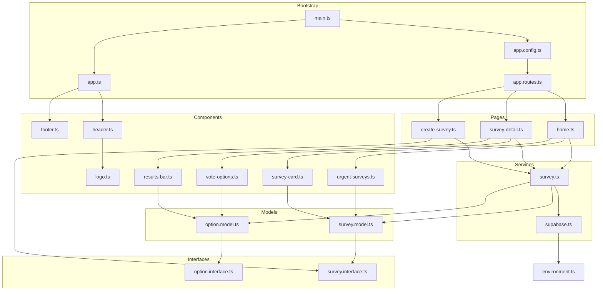

# PollApp — Imports & Exports Übersicht

## Abhängigkeits-Diagramm

---

## Alle Dateien im Detail

### Bootstrap & Konfiguration

| Datei | Exportiert | Importiert | Funktion |
|---|---|---|---|
| `main.ts` | — | bootstrapApplication, appConfig, App | Startet die Angular-App mit Root-Komponente und Config |
| `app.config.ts` | `appConfig` | ApplicationConfig, provideRouter, routes | Registriert globale Provider: Router, Error-Handler |
| `app.routes.ts` | `routes` | Routes, Home, SurveyDetail, CreateSurvey | Ordnet URL-Pfade den drei Page-Komponenten zu |
| `app.ts` | `App` | RouterOutlet, Header, Footer | Shell: Header + aktuell geroutete Seite + Footer |

---

### Shared / Interfaces

| Datei | Exportiert | Importiert | Funktion |
|---|---|---|---|
| `survey.interface.ts` | `Survey`, `SURVEY_CATEGORIES`, `SurveyCategory` | — | Legt die Datenstruktur einer Umfrage fest (id, title, deadline …) |
| `option.interface.ts` | `Option` | — | Legt die Datenstruktur einer Antwortoption fest (id, label, vote_count) |

---

### Shared / Models

| Datei | Exportiert | Importiert | Funktion |
|---|---|---|---|
| `survey.model.ts` | `SurveyModel` | Survey (Interface) | Kapselt Survey-Daten mit Hilfsmethoden: isActive(), isUrgent(), endsInLabel(), getCleanAddJson() |
| `option.model.ts` | `OptionModel` | Option (Interface) | Kapselt Option-Daten mit Hilfsmethoden: getPercentage(), letter() |

---

### Shared / Services

| Datei | Exportiert | Importiert | Funktion |
|---|---|---|---|
| `supabase.ts` | `SupabaseService` | createClient, SupabaseClient, environment | Erstellt einmalig den Supabase-Client — alle anderen Services nutzen diesen |
| `survey.ts` | `SurveyService` | SupabaseService, SurveyModel, OptionModel, Interfaces | Zentraler State: Signal-Array aller Umfragen + CRUD + Realtime-Subscription |

---

### Shared / Components

| Datei | Exportiert | Importiert | Funktion |
|---|---|---|---|
| `logo.ts` | `Logo` | input | Zeigt das App-Logo, Größe per Input (sm/md/lg) konfigurierbar |
| `survey-card.ts` | `SurveyCard` | RouterLink, SurveyModel | Karte in der Umfragen-Liste: Titel, Kategorie, Deadline-Anzeige |
| `urgent-surveys.ts` | `UrgentSurveys` | RouterLink, SurveyModel | Hebt Umfragen hervor, die in weniger als 48 Stunden enden |
| `vote-options.ts` | `VoteOptions` | input, output, signal, OptionModel | Zeigt Abstimmungs-Optionen, gibt gewählte Option per EventEmitter aus |
| `results-bar.ts` | `ResultsBar` | input, computed, OptionModel | Zeigt Balkendiagramm mit Prozentwerten pro Option |

---

### Layout

| Datei | Exportiert | Importiert | Funktion |
|---|---|---|---|
| `header.ts` | `Header` | RouterLink, Logo | Globale Navigation: Logo links, "New Survey"-Button rechts |
| `footer.ts` | `Footer` | — | Fußzeile mit aktuellem Jahr |

---

### Pages

| Datei | Exportiert | Importiert | Funktion |
|---|---|---|---|
| `home.ts` | `Home` | SurveyService, UrgentSurveys, SurveyCard | Startseite: Urgent-Banner + Tabs (Aktiv / Abgeschlossen) mit Umfragen-Liste |
| `survey-detail.ts` | `SurveyDetail` | SurveyService, VoteOptions, ResultsBar, ActivatedRoute | Detailseite: Vote-Karte links + Ergebnis-Karte rechts, localStorage-Check |
| `create-survey.ts` | `CreateSurvey` | SurveyService, FormBuilder, Validators, SURVEY_CATEGORIES | Formularseite: Reactive Form mit dynamischen Optionen (2–8 Stück) |

---

### Environments

| Datei | Exportiert | Importiert | Funktion |
|---|---|---|---|
| `environment.ts` | `environment` | — | Enthält Supabase-URL und API-Key (nicht committen — in .gitignore) |